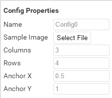
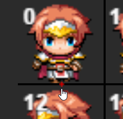
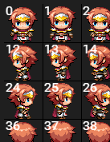
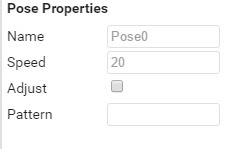
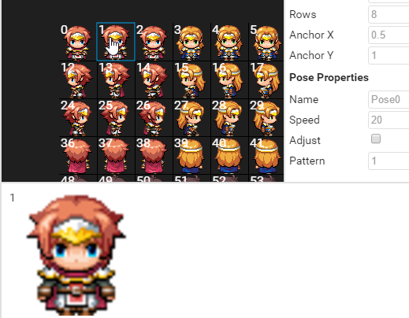

# Links

[Webpage](https://quxios.github.io/#/)

[Github Repo](https://github.com/quxios/QSpriteEditor)

[RPGMakerWebs thread](https://forums.rpgmakerweb.com/index.php?threads/qplugins-latest-qimport.73023/)

# Controls
Pan with middle mouse button / right mouse button

Add index to pattern by left clicking on it

Zoom in/out with scroll wheel

Move items around in configs / pose / pattern lift by drag-n-drop

# Instructions
## Step 1: Load project
Click on load and load your RPG Maker MV project. It will load in the file `data/QSprite.json` if the file is not found it will be created.

## Step 2: Creating a config
Click on the `+New` button at the bottom of the configs list to create a new config.
Configs will be used to give rules to your spritesheets.

## Step 3: Configuring a config
Once you select a config, you should see 2 new panels appear. A Pose list to the right
of the config list and a properties bar on the far right of the app. In the properties
bar you should see a configs section that looks like:

### Name
The name of the configuration that will be used to identify the config. Each config name should be unique and different!

This value is used to identify the image as a QSprite by naming the file with the following format:
~~~
%configName-fileName
~~~
configName – the Name we set for the config

*This is if you're using the default `File Name Identifier` in the QSprite plugin
parameters*

### Sample Image
The sample image the editor will use for this config to show the slices and preview of poses.

### Columns
The number of times to slice the image vertically.

### Rows
The number of times to slice the image horizontally.

### AnchorX / Y
The anchor position on for the sprite. The anchor position is shown on the 1st sprite frame as a red cross:

### Indexes
Onc you have
set a sample Image and set the cols/rows, you should see numbers
on the upper left of each frame(slice). These numbers are the index for that frame
and will be used for creating a pose pattern.

### Poses
If a config is selected, to the right of the config list there should be a poses
list. Each config have their own set of poses. To create a new pose, simply click
on the `+New` button at the bottom of the poses list panel.

## Step 3: Configuring a pose
Once you create a pose and select it, you should see a preview sprite appear in the
stage area, a new panel at the bottom (Pattern list panel) and in the properties
panel you should now also see properties for the pose.

### Name
The name of the pose. Each pose name should be unique and different!

### Speed
The wait time between the frames in the pattern.

### Adjust
If enabled it will adjust the Speed value based on the characters move speed ( MV Default behavior )

### Pattern
A list of indexes that the pose will play. Each index should be separated a comma.
You can also click on a frame and it will be added to the pattern bar at the bottom.

## Default Poses from QSprite Plugin
The QSprite plugin includes a few built in poses:
- moveX
- dashX
- idleX
- idle[A-Z]X
- default

Where X is the direction:

- 2: down
- 4: left
- 6: right
- 8: up
- 1: lower left
- 3: lower right
- 7: upper left
- 9: upper right

Default pose is used when and idleX or moveX is not found.
*Note that default does not have an X at the end, it's just default. Has no directions tied to it.*

For more information visit the [QSprite plugin page](https://quxios.github.io/#/plugins/QSprite).
